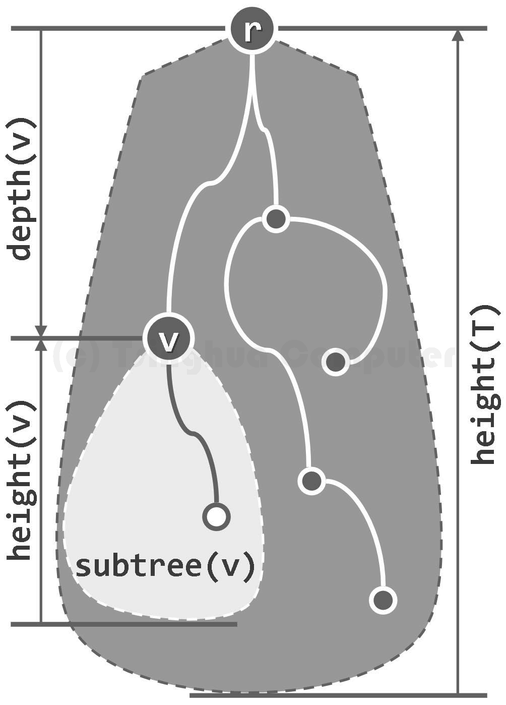

# 二叉树 Binary Tree

---

## 1.树

### 1.1 应用

> 层次表示的关系：
> * 表达式
> * 文件系统
> * URL
> * ...

> 综合性：
> * 兼具Vector和List的优点
> * 兼顾高效的*查找*、*插入*、*删除*

> 半线性：
> * 不再是简单的线性结构
> * 但在确定某种次序之后，具有线性特征

### 1.2 有根树

> * 树是特殊的图T = (V, E)，节点数|V| = n，边数|E| = e
> * 指定任一节点r ∈ V作为**根**后，T即称作**有根树**（rooted tree）
> * 若：T1, T2, ... , Td为有根树
> * 则：T = ((∪Vi) ∪ {r}, (∪Ei) ∪ {<r, ri> | 1 ≤ i ≤ d})也是
> * 相对于T，Ti称作以ri为根的**子树**（subtree rooted at ri），记作Ti = subtree(ri)

### 1.3 有序树

> * ri称作r的**孩子**（child），ri之间互称**兄弟**（sibling）
> * r为其**父亲**（parent），d = degree(r)为r的（出）**度**（degree）
> * 可归纳证明：e = Σr∈Vdegree(r) = n - 1 = Θ(n)
> * 故在衡量相关复杂度时，可以n作为参照
> * 若指定Ti作为T的第i棵子树，ri作为r的第i个孩子，则T称作**有序树**（ordered tree）

### 1.4 路径 + 环路

> * V中的k + 1个节点，通过E中的k条边依次相联，构成一条**路径**（path）
> * π = {(v0, v1), (v1, v2), ... , (vk-1, vk)}
> * 路径**长度**：|π| = 边数 = k
> * **环路**（cycle / loop）：vk = v0

### 1.5 连通 + 无环

> * 节点之间均有路径，称作**连通图**（connected）
> * 不含路径，称作**无环图**（acyclic）
> * 树：无环连通图、极小连通图、极大无环图
> * 故：任一节点v与根r之间存在唯一路径path(v, r) = path(v)
> * 于是：以|path(v)|为指标可对所有节点做**等价类**划分

### 1.6 深度 + 层次

